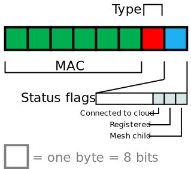
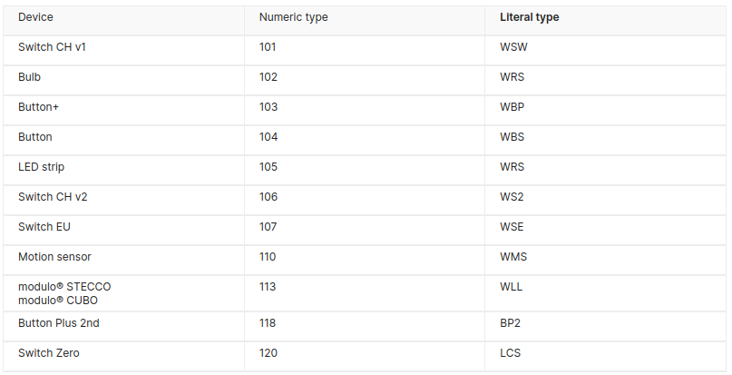

# myStrom

- [myStrom](#mystrom)
  - [Présentation](#présentation)
  - [La prise myStrom WiFi Switch](#la-prise-mystrom-wifi-switch)
  - [Détecter les appareils myStrom](#détecter-les-appareils-mystrom)
  - [HTTP API REST](#http-api-rest)
    - [Tests CLI](#tests-cli)
    - [Android Java](#android-java)
    - [Qt C++](#qt-c)
  - [Auteur](#auteur)

---

## Présentation

Lien : https://mystrom.ch/fr/

## La prise myStrom WiFi Switch

Le _myStrom WiFi Switch_ (prise) est un système de Gestion d’Energie qui aide à contrôler la consommation en énergie et à éteindre et à allumer les appareils qui lui sont connectés.

> La prise myStrom WiFi possède la fonction de mesure du courant (max 16A). De plus, elle mesure la température de la pièce.


|Caractéristiques||
|---|---|
|Standard wireless/WiFi|IEEE 802.11n / 2.4 GHz (1)|
|Boutons|On/Off • WPS|
|Voyants LED|Status • Relais|
|Dimensions|87 x 150 x 87 mm|
|Poids|120 g|
|Spectre de mesure & précision|2 — 3680 Watt • <1 %|
|Consommation électrique maximale|16A|
|Entrée d’alimentation|100 – 240 VAC • 50/60 Hz|
|Sortie d’alimentation|100 – 240 VAC • 50/60 Hz • 9.9 A|
|Consommation en énergie|1.4 Watt (on) • 0.9 Watt (off)|
|Garantie|2 ans (sur matériel)|

Liens :

- https://mystrom.com/fr/wifi-switch/
- https://mystrom.com/fr/support/wifi-switch/

## Détecter les appareils myStrom

Pour découvrir un appareil myStrom sur le réseau, il faut écouter sur le port **UDP 7979** (les paquets émis en _broadcast_ `255.255.255.255`). Chaque appareil myStrom diffusera un message (les boutons uniquement s'ils sont en mode configuration).

Les 6 premiers octets contiennent l'adresse MAC de l'appareil et les deux octets suivants fournissent le type d'appareil et un état :



La liste des types de numéros :



Capture wireshark :


L'adresse IP de la prise : `192.168.1.47`

Les 8 octets : `08 3a f2 71 e8 00 6b 04`

|Champ|Valeur|
|-----|------|
|Adresse MAC | `08:3a:f2:71:e8:00` |
|Type | `0x6b` -> `107` = Switch EU (prise européenne)|
|État | `0x04` -> `00000100` = _connected to cloud_|

## HTTP API REST

Tous les appareils myStrom proposent une API REST.

https://api.mystrom.ch/#rest-api

- _myStrom WiFi Switch_ :

|Fonction|Requête|Réponse|
|---|:---:|:---:|
|Set State ON |`http://[IP]/relay?state=1`||
|Set State OFF |`http://[IP]/relay?state=0`||
|Set State TOGGLE |`http://[IP]/toggle`||
|Get Values |`http://[IP]/report`|`{"power":0,"Ws":0,"relay":true,"temperature":21.5}`|

### Tests CLI

- Recherche de réseaux WiFi :

```bash
$ curl --location -g 'http://192.168.1.47/api/v1/scan'
["Livebox-Z6C0",-49,"Livebox-Z6C0-IoT",-49,"DIRECT-92BBEB23",-60]
```

- Configuration du réseau WiFi :

```bash
curl --location -g 'http://192.168.1.47/api/v1/connect' \
--data '{
    "ssid": "Livebox-Z6C0",
    "passwd": "PASSWORD"
}'
```

- Informations :

```bash
$ curl --location -g 'http://192.168.1.47/api/v1/info'
{"version":"3.83.1","mac":"083AF271E800","ssid":"Livebox-Z6C0","ip":"192.168.1.47","mask":"255.255.255.0","gw":"192.168.1.1","dns":"192.168.1.1","static":false,"connected":true,"type":107,"connectionStatus":{"ntp":true,"dns":true,"connection":true,"handshake":true,"login":true}}
```

- États :

```bash
$ curl --location -g 'http://192.168.1.47/report'
{"power":0,"Ws":0,"relay":true,"temperature":21.5}
```

Commander la prise :

```bash
$ curl --location -g 'http://192.168.1.47/relay?state=1'

$ curl --location -g 'http://192.168.1.47/relay?state=0'
```

### Android Java


### Qt C++


## Auteur

- Thierry VAIRA <<thierry.vaira@gmail.com>>

---
&copy; 2024 LaSalle Avignon
