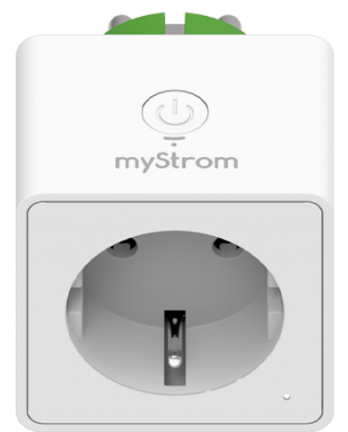
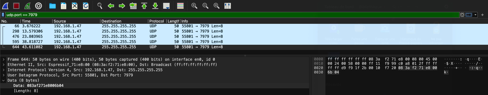

# myStorm

- [myStorm](#mystorm)
  - [Présentation](#présentation)
  - [La prise myStrom WiFi Switch](#la-prise-mystrom-wifi-switch)
  - [Détecter les appareils myStrom](#détecter-les-appareils-mystrom)
  - [HTTP API REST](#http-api-rest)
    - [Tests CLI](#tests-cli)
    - [Android Java](#android-java)
  - [Auteurs](#auteurs)

---

## Présentation

Lien : https://mystrom.ch/fr/

## La prise myStrom WiFi Switch

La prise WiFi possède la fonction de mesure du courant (max 16A). De plus, elle mesure la température de la pièce.



Lien : https://mystrom.com/fr/wifi-switch/

## Détecter les appareils myStrom

Pour découvrir un appareil myStrom sur le réseau, il faut écouter sur le port **UDP 7979**. Chaque appareil myStrom diffusera un message (les boutons uniquement s'ils sont en mode configuration).

Les 6 premiers octets contiennent l'adresse MAC de l'appareil et les deux octets suivants sont un nombre qui correspond au type d'appareil. Voir ci-dessous pour la liste des types de numéros.

Capture wireshark :



Les 8 octets : `08 3a f2 71 e8 00 6b 04`

|Champ|Valeur|
|-----|------|
|Adresse IP | `192.168.1.47` |
|Adresse MAC | `08:3a:f2:71:e8:00` |
|Type | `0x6b` -> `107` = Switch EU (prise européenne)|

## HTTP API REST

Tous les appareils myStrom proposent une API REST.

https://api.mystrom.ch/#rest-api

### Tests CLI

- Configuration :

```bash

```

- Informations :

```bash
$ curl --location -g 'http://192.168.1.47/api/v1/info'
{"version":"3.83.1","mac":"083AF271E800","ssid":"Livebox-86D0","ip":"192.168.1.47","mask":"255.255.255.0","gw":"192.168.1.1","dns":"192.168.1.1","static":false,"connected":true,"type":107,"connectionStatus":{"ntp":true,"dns":true,"connection":true,"handshake":true,"login":true}}
```

- États :

```bash
$ curl --location -g 'http://192.168.1.47/report'
{"power":0,"Ws":0,"relay":true,"temperature":21.5}
```

Commander la prise :

```bash
$ curl --location -g 'http://192.168.1.47/relay?state=1'

$ curl --location -g 'http://192.168.1.47/relay?state=0'
```

### Android Java


## Auteurs

- Jérôme BEAUMONT <<beaumontlasalle84@gmail.com>>
- Thierry VAIRA <<thierry.vaira@gmail.com>>

---
&copy; 2024 LaSalle Avignon
