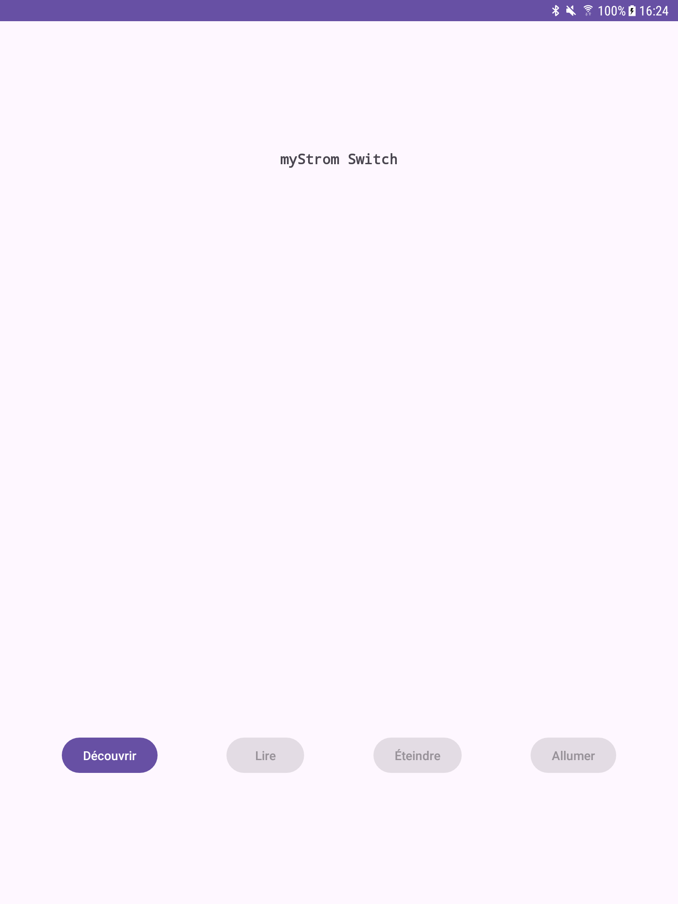

# myStrom

- [myStrom](#mystrom)
  - [Présentation](#présentation)
  - [La prise myStrom WiFi Switch](#la-prise-mystrom-wifi-switch)
  - [Détecter les appareils myStrom](#détecter-les-appareils-mystrom)
  - [HTTP API REST](#http-api-rest)
    - [Tests CLI](#tests-cli)
    - [Android Java](#android-java)
      - [Requêtes HTTP](#requêtes-http)
      - [Décodage JSON](#décodage-json)
      - [Réception UDP](#réception-udp)
      - [Screenshots](#screenshots)
    - [Qt C++](#qt-c)
      - [Requêtes HTTP](#requêtes-http-1)
      - [Décodage JSON](#décodage-json-1)
      - [Réception UDP](#réception-udp-1)
      - [Screenshots](#screenshots-1)
  - [Auteur](#auteur)

---

## Présentation

Lien : https://mystrom.ch/fr/

## La prise myStrom WiFi Switch

Le _myStrom WiFi Switch_ (prise) est un système de Gestion d’Energie qui aide à contrôler la consommation en énergie et à éteindre et à allumer les appareils qui lui sont connectés.

> La prise myStrom WiFi possède la fonction de mesure du courant (max 16A). De plus, elle mesure la température de la pièce.


|Caractéristiques||
|---|---|
|Standard wireless/WiFi|IEEE 802.11n / 2.4 GHz (1)|
|Boutons|On/Off • WPS|
|Voyants LED|Status • Relais|
|Dimensions|87 x 150 x 87 mm|
|Poids|120 g|
|Spectre de mesure & précision|2 — 3680 Watt • <1 %|
|Consommation électrique maximale|16A|
|Entrée d’alimentation|100 – 240 VAC • 50/60 Hz|
|Sortie d’alimentation|100 – 240 VAC • 50/60 Hz • 9.9 A|
|Consommation en énergie|1.4 Watt (on) • 0.9 Watt (off)|
|Garantie|2 ans (sur matériel)|

Liens :

- https://mystrom.com/fr/wifi-switch/
- https://mystrom.com/fr/support/wifi-switch/

## Détecter les appareils myStrom

Pour découvrir un appareil myStrom sur le réseau, il faut écouter sur le port **UDP 7979** (les paquets émis en _broadcast_ `255.255.255.255`). Chaque appareil myStrom diffusera un message (les boutons uniquement s'ils sont en mode configuration).

Les 6 premiers octets contiennent l'adresse MAC de l'appareil et les deux octets suivants fournissent le type d'appareil et un état :


La liste des types de numéros :


Capture wireshark :


L'adresse IP de la prise : `192.168.1.47`

Les 8 octets : `08 3a f2 71 e8 00 6b 04`

|Champ|Valeur|
|-----|------|
|Adresse MAC | `08:3a:f2:71:e8:00` |
|Type | `0x6b` -> `107` = Switch EU (prise européenne)|
|État | `0x04` -> `00000100` = _connected to cloud_|

## HTTP API REST

Tous les appareils myStrom proposent une API REST.

https://api.mystrom.ch/#rest-api

- _myStrom WiFi Switch_ :

|Fonction|Requête|Réponse|
|---|:---:|:---:|
|Set State ON |`http://[IP]/relay?state=1`||
|Set State OFF |`http://[IP]/relay?state=0`||
|Set State TOGGLE |`http://[IP]/toggle`||
|Get Values |`http://[IP]/report`|`{"power":0,"Ws":0,"relay":true,"temperature":21.5}`|

> Les prises myStrom envoient une valeur instantanée de la puissance (`power`) en [Watt](https://fr.wikipedia.org/wiki/Watt) (`W`) et la quantité d'énergie (`Ws`)  sur une période de 30 s en Ws.

### Tests CLI

- Recherche de réseaux WiFi :

```bash
$ curl --location -g 'http://192.168.1.47/api/v1/scan'
["Livebox-Z6C0",-49,"Livebox-Z6C0-IoT",-49,"DIRECT-92BBEB23",-60]
```

- Configuration du réseau WiFi :

```bash
curl --location -g 'http://192.168.1.47/api/v1/connect' \
--data '{
    "ssid": "Livebox-Z6C0",
    "passwd": "PASSWORD"
}'
```

- Informations :

```bash
$ curl --location -g 'http://192.168.1.47/api/v1/info'
{"version":"3.83.1","mac":"083AF271E800","ssid":"Livebox-Z6C0","ip":"192.168.1.47","mask":"255.255.255.0","gw":"192.168.1.1","dns":"192.168.1.1","static":false,"connected":true,"type":107,"connectionStatus":{"ntp":true,"dns":true,"connection":true,"handshake":true,"login":true}}
```

- États :

```bash
$ curl --location -g 'http://192.168.1.47/report'
{"power":0,"Ws":0,"relay":true,"temperature":21.5}
```

Commander la prise :

```bash
$ curl --location -g 'http://192.168.1.47/relay?state=1'

$ curl --location -g 'http://192.168.1.47/relay?state=0'
```

### Android Java

L'application Qt doit être capable d'émettre des requêtes HTTP, décoder des données [JSON](http://tvaira.free.fr/projets/activites/activite-json.html) et de recevoir des datagrammes UDP.

#### Requêtes HTTP

Pour émettre des requêtes HTTP sous Android, il y a plusieurs possibilités. Ici, on utilisera le client [OkHttp](https://square.github.io/okhttp/).

> On pourrait aussi utiliser le [client HTTP](https://cloud.google.com/java/docs/reference/google-http-client/latest/com.google.api.client.http) de l'API Google.

Pour utiliser [OkHttp](https://square.github.io/okhttp/), il faut tout d'abord ajouter dans le fichier `app/build.gradle` :

```
dependencies {
    ...
    implementation 'com.squareup.okhttp3:okhttp:4.12.0'
    ...
}
```

Dans le code source java, il faut préalablement importer les différentes classes utiles pour émettre des requêtes HTTP :

```java
import okhttp3.Call;
import okhttp3.Callback;
import okhttp3.OkHttpClient;
import okhttp3.Request;
import okhttp3.Response;
import okhttp3.MediaType;
import okhttp3.RequestBody;
```

On commence par instancier un objet de type `OkHttpClient` :

```java
OkHttpClient clientOkHttp = new OkHttpClient();
```

Émettre une requête **GET** pour obtenir les informations de la prise :

```java
String adresseIPSwitchStrom = "192.168.1.47";
String url = "http://" + adresseIPSwitchStrom + "/report";
Request request = new Request.Builder()
                      .url(url)
                      .addHeader("Content-Type", "application/json")
                      .addHeader("Accept", "application/json")
                      .build();

clientOkHttp.newCall(request).enqueue(new Callback() {
    @Override
    public void onFailure(Call call, IOException e)
    {
        e.printStackTrace();
    }

    @Override
    public void onResponse(Call call, Response response) throws IOException
    {
        Log.d(TAG, "onResponse - message = " + response.message());
        Log.d(TAG, "onResponse - code    = " + response.code());

        if(!response.isSuccessful())
        {
            throw new IOException(response.toString());
        }

        final String body = response.body().string();
        Log.d(TAG, "onResponse - body    = " + body);
        // @todo décoder les données JSON
    }
});
```

Émettre une requête **GET** pour activer la prise :

```java
String adresseIPSwitchStrom = "192.168.1.47";
// @see "http://" + adresseIPSwitchStrom + "/toogle";
String url = "http://" + adresseIPSwitchStrom + "/relay?state=1"; // /relay?state=0 pour éteindre
Request request = new Request.Builder()
                      .url(url)
                      .addHeader("Content-Type", "application/json")
                      .addHeader("Accept", "application/json")
                      .build();

clientOkHttp.newCall(request).enqueue(new Callback() {
    @Override
    public void onFailure(Call call, IOException e)
    {
        e.printStackTrace();
    }

    @Override
    public void onResponse(Call call, Response response) throws IOException
    {
        Log.d(TAG, "onResponse - message = " + response.message());
        Log.d(TAG, "onResponse - code    = " + response.code());

        if(!response.isSuccessful())
        {
            throw new IOException(response.toString());
        }
    }
});
```

#### Décodage JSON

La requête **GET** `/report` retourne des données [JSON](http://tvaira.free.fr/projets/activites/activite-json.html) :

```json
{"power":0,"Ws":0,"relay":true,"temperature":21.5}
```

Exemple de décodage :

```cpp
QString donneesJSON = "{\"power\":0,\"Ws\":0,\"relay\":true,\"temperature\":21.5}";
JSONObject json = null;

try
{
    json = new JSONObject(donneesJSON);
    if(json.has("power"))
    {
        Log.d(TAG, "lireEtat() power = " + json.getDouble("power"));
    }
    // ...
    Log.d(TAG, "lireEtat() Ws    = " + json.getDouble("Ws"));
    Log.d(TAG, "lireEtat() relay = " + json.getBoolean("relay"));
    Log.d(TAG, "lireEtat() temperature = " + json.getDouble("temperature"));
}
catch(JSONException e)
{
    e.printStackTrace();
}
```

#### Réception UDP

Pour découvrir un appareil myStrom sur le réseau, il faut écouter sur le port **UDP 7979** (les paquets émis en _broadcast_ `255.255.255.255`). Chaque appareil myStrom diffusera un message (les boutons uniquement s'ils sont en mode configuration).

Pour [communiquer en UDP sous Android](http://tvaira.free.fr/dev/android/android-udp.html), il faudra utiliser l'interface Java des sockets (_package_ `java.net`).

```java
private DatagramSocket socket;
private final int PORT_DETECTION_MYSTROM = 7979;
private final int TIMEOUT_RECEPTION_REPONSE = 30000;
```

Exemple :

```java
private void decouvrirAppareilsMyStrom()
{
    if(socket == null) {
        try {
            socket = new DatagramSocket(PORT_DETECTION_MYSTROM);
            socket.setSoTimeout(TIMEOUT_RECEPTION_REPONSE);
        } catch (SocketException se) {
            se.printStackTrace();
        }
    }
    runOnUiThread(new Runnable() {
        @Override
        public void run()
        {
            while (socket != null && !socket.isClosed()) {
                byte[] bufferReception = new byte[8];
                DatagramPacket datagramme = new DatagramPacket(bufferReception, bufferReception.length);

                try {
                    socket.receive(datagramme);
                    String adresseIPSwitch = datagramme.getAddress().toString();
                    Log.d(TAG, "decouvrirAppareilsMyStrom() emetteurAdresse = " + adresseIPSwitch.substring(1) + " emetteurPort = " + datagramme.getPort());
                    StringBuilder donneesRecues = new StringBuilder();
                    for (byte b : datagramme.getData()) {
                        donneesRecues.append(String.format("%02X ", b));
                    }
                    Log.d(TAG, "decouvrirAppareilsMyStrom() donneesRecues = " + donneesRecues + " nbOctets = " + datagramme.getLength());

                    // ...

                    if(adresseIPSwitch.substring(1).length() > 0)
                        adresseIPSwitchStrom = adresseIPSwitch.substring(1);
                    return;
                } catch (IOException e) {
                    throw new RuntimeException(e);
                }
            }
        }
    });
}
```

#### Screenshots

Un exemple d'application Android "basique" est fourni dans `src/android/` :




### Qt C++

L'application Qt doit être capable d'émettre des requêtes HTTP, décoder des données [JSON](http://tvaira.free.fr/projets/activites/activite-json.html) et de recevoir des datagrammes UDP.

#### Requêtes HTTP

Pour émettre des requêtes HTTP sous Qt, il faudra utiliser la classe [QNetworkAccessManager](https://doc.qt.io/qt-6/qnetworkaccessmanager.html).

Il faut tout d'abord activer le module `network` dans le fichier de projet `.pro` pour accéder aux classes :

```
QT += network
```

Il faut ensuite accéder aux déclarations des classes :

```cpp
#include <QtNetwork/QNetworkAccessManager>
#include <QNetworkReply>
```

On commence par instancier un objet de type `QNetworkAccessManager` :

```cpp
QNetworkAccessManager* accesReseau = new QNetworkAccessManager(this);
```

Il faut ensuite connecter le signal `finished()` à un slot qui permettra de traiter la réponse à une requête :

```cpp
connect(accesReseau,
        SIGNAL(finished(QNetworkReply*)),
        this,
        SLOT(traiterReponseSwitch(QNetworkReply*)));
```

Émettre une requête **GET** pour récupérer les informations de la prise :

```cpp
QString         api = "http://" + adresseIPSwitch + "/report";
QUrl            url = QUrl(api);
QNetworkRequest requeteGet;
requeteGet.setUrl(url);
requeteGet.setRawHeader("Content-Type", "application/json");
requeteGet.setRawHeader(QByteArray("Accept"), QByteArray("application/json"));
accesReseau->get(requeteGet);
```

Le slot sera automatiquement appelé lorsque la réponse sera reçue et permettra de traiter les données [JSON](https://doc.qt.io/qt-6/qjsondocument.html) reçues :

```cpp
void MyStromSwitch::traiterReponseSwitch(QNetworkReply* reponse)
{
    if(reponse->error() != QNetworkReply::NoError)
    {
        return;
    }
    QByteArray donneesReponse = reponse->readAll();

    QJsonDocument documentJson = QJsonDocument::fromJson(donneesReponse);

    if(requeteApi.contains("report"))
    {
        /*
            {"power":0,"Ws":0,"relay":true,"temperature":21.5}
        */
        QJsonObject json = documentJson.object();
        qDebug() << Q_FUNC_INFO << "power" << json["power"].toDouble();
        qDebug() << Q_FUNC_INFO << "Ws" << json["Ws"].toDouble();
        qDebug() << Q_FUNC_INFO << "relay" << json["relay"].toBool();
        qDebug() << Q_FUNC_INFO << "temperature" << json["temperature"].toDouble();
    }
    else if(requeteApi.contains("relay"))
    {
        emit nouvelEtat();
    }
}
```

Émettre une requête **GET** pour activer la prise :

```cpp
// @see http://[IP]/toggle
QString         api = "http://" + adresseIPSwitch + "/relay?state=1"; // /relay?state=0 pour éteindre
QNetworkRequest requeteGet;
QUrl            url = QUrl(api);
requeteGet.setUrl(url);
requeteGet.setRawHeader("Content-Type", "application/json");
requeteGet.setRawHeader(QByteArray("Accept"), QByteArray("application/json"));
accesReseau->get(requeteGet);
```

#### Décodage JSON

La requête **GET** `/report` retourne des données [JSON](http://tvaira.free.fr/projets/activites/activite-json.html) :

```json
{"power":0,"Ws":0,"relay":true,"temperature":21.5}
```

Qt fournit des classes pour traiter des données [JSON](http://tvaira.free.fr/projets/activites/activite-json.html), notamment :

- QJsonDocument : https://doc.qt.io/qt-6/qjsondocument.html
- QJsonObject : https://doc.qt.io/qt-6/qjsonobject.html

Exemple de décodage :

```cpp
QByteArray donneesJSON = "{\"power\":0,\"Ws\":0,\"relay\":true,\"temperature\":21.5}";
QJsonDocument documentJson = QJsonDocument::fromJson(donneesReponse);

QJsonObject json = documentJson.object();
qDebug() << Q_FUNC_INFO << "power" << json["power"].toDouble();
qDebug() << Q_FUNC_INFO << "Ws" << json["Ws"].toDouble();
qDebug() << Q_FUNC_INFO << "relay" << json["relay"].toBool();
qDebug() << Q_FUNC_INFO << "temperature" << json["temperature"].toDouble();
```

#### Réception UDP

Pour découvrir un appareil myStrom sur le réseau, il faut écouter sur le port **UDP 7979** (les paquets émis en _broadcast_ `255.255.255.255`). Chaque appareil myStrom diffusera un message (les boutons uniquement s'ils sont en mode configuration).

Pour communiquer en UDP sous Qt, il faudra utiliser la classe [QUdpSocket](https://doc.qt.io/qt-6/qudpsocket.html) qui fait partie aussi du module `network`.

Il faut accéder aux déclarations des classes :

```cpp
#include <QUdpSocket>
#include <QNetworkDatagram>
```

On commence par instancier un objet de type `QUdpSocket` :

```cpp
QUdpSocket* udpSocket = new QUdpSocket(this);
```

Il est nécessaire d'attacher la _socket_ UDP localement au port `7979` :

```cpp
udpSocket->bind(QHostAddress::AnyIPv4, 7979);
```

Il faut ensuite connecter le signal `readyRead()` à un slot qui permettra de traiter les datagrammes reçus sur la _socket_ UDP :

```cpp
connect(udpSocket, SIGNAL(readyRead()), this, SLOT(receptionnerDatagrammes()));
```

Le slot sera automatiquement appelé lorsque des datagrammes UDP seront reçus :

```cpp
void MyStromSwitch::receptionnerDatagrammes()
{
    while(udpSocket->hasPendingDatagrams())
    {
        QNetworkDatagram datagramme = udpSocket->receiveDatagram();

        qDebug() << Q_FUNC_INFO << "emetteurAdresse" << datagramme.senderAddress().toString()
                 << "emetteurPort" << datagramme.senderPort();
        qDebug() << Q_FUNC_INFO << "destinationAdresse"
                 << datagramme.destinationAddress().toString() << "destinationPort"
                 << datagramme.destinationPort();
        qDebug() << Q_FUNC_INFO << "nbOctets" << datagramme.data().size() << "donneesDatagramme"
                 << datagramme.data().toHex();

        if(datagramme.destinationAddress().toString() == "255.255.255.255" &&
           datagramme.destinationPort() == PORT_UDP_MYSTROM)
        {
            adresseIPSwitch = datagramme.senderAddress().toString();
            return;
        }
    }
}
```

#### Screenshots

Un exemple d'application Qt "basique" est fourni dans `src/qt/` :


## Auteur

- Thierry VAIRA <<thierry.vaira@gmail.com>>

---
&copy; 2024 LaSalle Avignon
